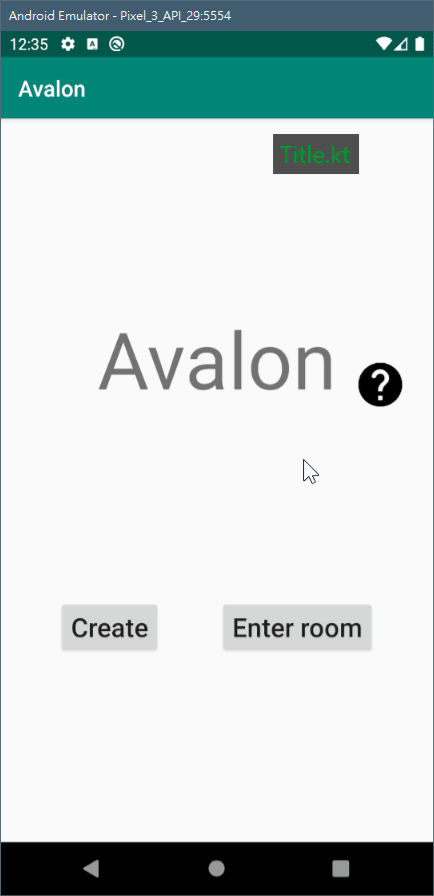
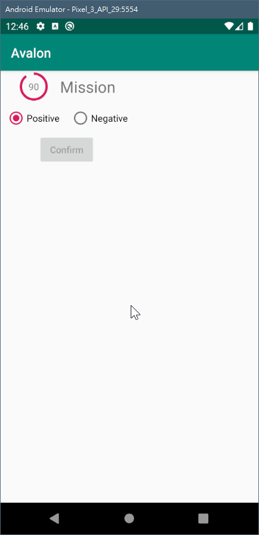

# Avalon

## Development state

### PermissionHelper.kt


### Title.kt



### ChoiceCountDownView.kt



#### Usage

```kotlin
// cd is the class
val p = Player(/* player name = */ name).apply {
  // Thus can prevent good side from making
  // mission failed
  character = Mordred(/* context = */ context)
}
cd.setPlayer(p)
cd.startCountDown(ChoiceCountDownView.MISSION, /* seconds = */ 480, callback)
```
